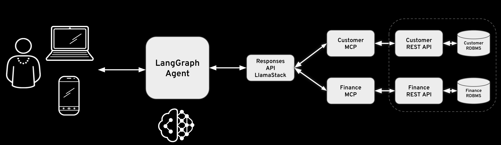

# LangGraph -> Llama Stack -> MCP Server

This project builds up to using LangGraph clients that connect THROUGH Llama Stack into MCP Servers.  

## Setup
```bash
python3.12 -m venv .venv
source .venv/bin/activate
pip install -r requirements.txt
```

## Architecture



## Follow the numbers

The goal is to arrive at a basic Agent that accepts an email address and finds the orders for that customer.

```bash
cp .env.example .env
```

And edit accordingly

```bash
set -a
source .env
set +a
```

## Fast API Backend

```bash
cd langgraph-fastapi
python langgraph_fastapi.py
```

```bash
open http://localhost:8000/docs
```

### Tests using the MCP Servers

```bash
curl -sS "http://localhost:8000/find_orders?email=thomashardy@example.com" | jq
curl -sS "http://localhost:8000/find_invoices?email=liuwong@example.com" | jq
```

### Tests using non-customer contacts (not in database)

```bash
curl -sS -G "http://localhost:8000/question" --data-urlencode "q=who is Burr Sutter?"
curl -sS -G "http://localhost:8000/question" --data-urlencode "q=who is Natale Vinto of Red Hat?"
```

### Tests using customer contacts

```bash
curl -sS -G "http://localhost:8000/question" --data-urlencode "q=who is Thomas Hardy?"
curl -sS -G "http://localhost:8000/question" --data-urlencode "q=who does Thomas Hardy work for?"
curl -sS -G "http://localhost:8000/question" --data-urlencode "q=who does Fran Wilson work for?"
```

```bash
curl -sS -G "http://localhost:8000/question" --data-urlencode "q=list invoices for Thomas Hardy?"
curl -sS -G "http://localhost:8000/question" --data-urlencode "q=find orders for thomashardy@example.com?"
curl -sS -G "http://localhost:8000/question" --data-urlencode "q=get me invoices for Liu Wong?"
curl -sS -G "http://localhost:8000/question" --data-urlencode "q=fetch orders for liuwong@example.com?"
curl -sS -G "http://localhost:8000/question" --data-urlencode "q=fetch invoices for Fran Wilson?"
curl -sS -G "http://localhost:8000/question" --data-urlencode "q=fetch orders for franwilson@example.com?"

```

### Load Testing

Use `load_test.py` to run concurrent load tests against the API:

```bash
cd langgraph-fastapi

# Run with defaults (3 concurrent requests)
python load_test.py

# Sequential mode
python load_test.py --sequential

# Custom concurrency and iterations
python load_test.py -c 6 -n 3

# Enable debug logging to see actual responses
python load_test.py --debug
```

**Options:**
- `--url` - Base URL (default: `http://$SERVICE_URL:8000`, SERVICE_URL defaults to `langgraph-fastapi`)
- `-c, --concurrent` - Number of concurrent workers (default: 3)
- `-n, --iterations` - Run all queries N times (default: 1)
- `-s, --sequential` - Run requests one at a time
- `-v, --verbose` - Show full response content in summary
- `-d, --debug` - Enable debug logging to see actual responses
